# Fee Engine AI Assistant Flow Diagrams

Draft lifecycle, AI chat, fee-engine integration, and security flows for the fee-engine-ai-assistant service.

---

## 1. Generate Fee Rule — Happy Path

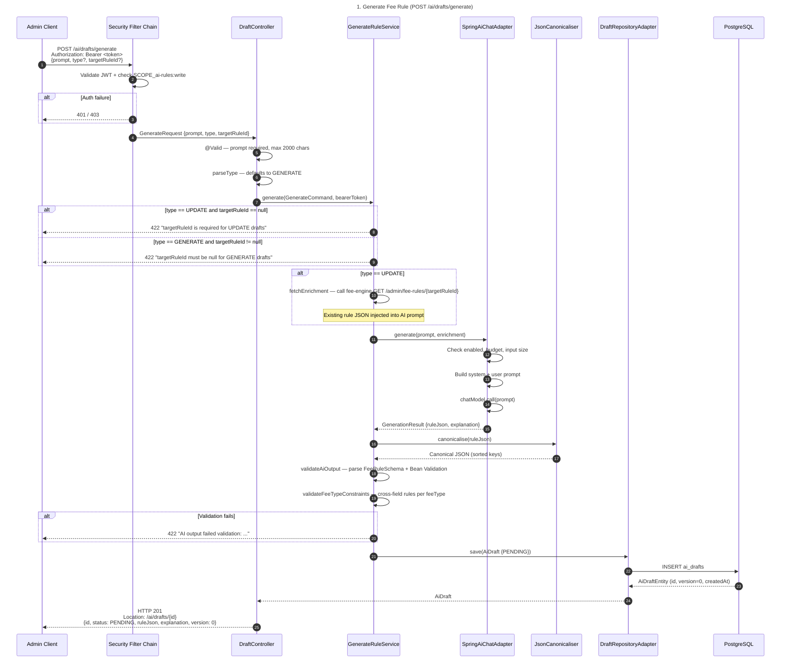

### Step Details

- **Step 1 — POST /ai/drafts/generate:** Admin sends a natural language prompt describing the desired fee rule. Optional `type` field (defaults to `GENERATE`) and optional `targetRuleId` for update drafts. Requires `SCOPE_ai-rules:write`.
- **Step 2 — Auth:** Single security filter chain validates the JWT bearer token and checks for `SCOPE_ai-rules:write`. Returns 401 (no/invalid token) or 403 (wrong scope) with `application/problem+json`.
- **Step 3 — @Valid:** Bean Validation checks `prompt` is not blank and ≤ 2000 characters. `type` and `targetRuleId` are optional.
- **Step 4 — parseType:** Converts the optional `type` string to `DraftType` enum. Defaults to `GENERATE` if null. Throws 422 for unrecognised values.
- **Step 5 — Command validation:** `GenerateRuleService.validate()` enforces type-targetRuleId consistency: UPDATE requires `targetRuleId`; GENERATE must not have one.
- **Step 6 — Enrichment (UPDATE only):** For UPDATE drafts, the service fetches the existing rule from fee-engine via `GET /admin/fee-rules/{targetRuleId}`. The existing rule JSON is injected into the AI prompt so the model can produce an updated version. If the target rule no longer exists (404), throws `TargetRuleNotFoundException` → 404.
- **Step 7 — AI generate:** `SpringAiChatAdapter.generate()` builds a user message combining the admin's prompt and (for UPDATE) the existing rule. The system prompt (loaded from `system-prompt.txt` with schema version placeholder) instructs the model to return JSON with `{"rule": {...}, "explanation": "..."}`.
- **Step 8 — Budget & guards:** Before calling the model, the adapter checks: AI enabled flag (503 if disabled), daily token budget (429 if exceeded), and combined prompt size against `maxInputChars` (422 if too large).
- **Step 9 — canonicalise:** `JsonCanonicaliser` parses the AI's rule JSON and re-serialises with alphabetically sorted keys. This ensures deterministic storage regardless of the model's key ordering.
- **Step 10 — Schema validation:** The canonical JSON is parsed into `FeeRuleSchema` and validated via Bean Validation (`@NotBlank` on required fields like `paymentType`, `scheme`, `chargeBearer`, `feeType`, `currency`).
- **Step 11 — Fee-type constraints:** `validateFeeTypeConstraints()` enforces cross-field rules per fee type — e.g. FLAT requires `flatAmount` and forbids `percentage`/`tiers`; TIERED_SLAB/TIERED_STEP require `tiers` with per-tier `rateType` validation (FIXED requires `amount`, PERCENTAGE requires `percentage`, HYBRID/GREATER_OF require both); FREE forbids all amount fields. The legacy `TIERED` fee type and unknown values are rejected. Failures throw `AiOutputParseException` → 422.
- **Step 12 — Persist draft:** A new `AiDraft` is created with status `PENDING` and saved via the repository adapter. JPA auditing populates `createdAt` and `createdBy` from the JWT `sub` claim.
- **Step 13 — 201 Created:** Controller returns the created draft with a `Location` header pointing to `/ai/drafts/{id}`.

---

## 2. AI Chat Adapter — Internal Flow

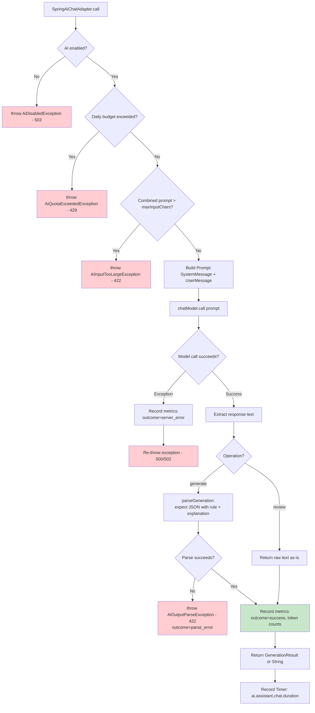

### Step Details

- **AI enabled check:** `AiChatProperties.isEnabled()` controls the feature toggle. When disabled, all AI operations immediately return 503 without calling the model. Useful for maintenance windows or cost control.
- **Daily budget check:** `AiChatBudget.isExceeded()` tracks cumulative token usage against `dailyTokenLimit` (0 = unlimited). Tokens are recorded after each call — either exact (from API response metadata) or estimated (chars/4).
- **Input size check:** Combined length of system prompt + user message is compared against `maxInputChars` (default 20,000). Prevents sending excessively large prompts that would waste tokens or hit model context limits.
- **Prompt construction:** For `generate` operations, the user message includes the admin's prompt and (for UPDATE) the existing rule JSON. For `review`, the user message contains the rule JSON to review. The system prompt from `system-prompt.txt` is always included — it defines the fee rule schema and expected response format.
- **Model call:** Spring AI's `ChatModel.call(prompt)` sends the request to the configured Anthropic-compatible API. The model is configured with `max-tokens: 4096` and `temperature: 0.2` for consistent, deterministic outputs.
- **Generate parsing:** `parseGeneration()` expects the model to return JSON with `{"rule": {...}, "explanation": "..."}`. If the response is not valid JSON or is missing either field, `AiOutputParseException` is thrown with a preview of the raw output (first 500 chars).
- **Review passthrough:** Review responses are returned as raw text — the AI's natural language analysis of the rule. No parsing is required.
- **Metrics recording:** Every call records `ai.assistant.chat.duration` (timer with operation + outcome tags), token counts (input/output, both exact and estimated), and error counters. The timer outcome is one of `success`, `parse_error`, or `server_error`.

---

## 3. Fee-Type Cross-Field Validation

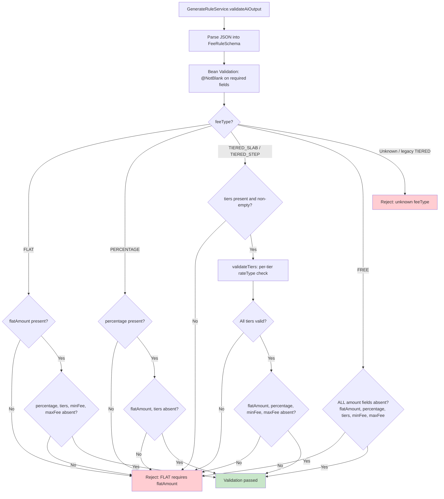

### Step Details

- **Parse into FeeRuleSchema:** The AI-generated canonical JSON is deserialised into a `FeeRuleSchema` record. If the JSON structure doesn't match (wrong types, missing fields), deserialisation fails → `AiOutputParseException` with the parsing error message.
- **Bean Validation:** Standard `@NotBlank` constraints on `paymentType`, `scheme`, `chargeBearer`, `chargeType`, `feeType`, `currency`. These run first and catch structurally incomplete outputs.
- **FLAT:** Requires `flatAmount` to be present and non-blank. Forbids `percentage`, `tiers`, `minFee`, `maxFee`. These fields would be meaningless for a fixed-amount fee.
- **PERCENTAGE:** Requires `percentage` to be present and non-blank. Forbids `flatAmount` and `tiers`. `minFee`/`maxFee` are allowed (they cap the percentage-based charge).
- **TIERED_SLAB / TIERED_STEP:** Requires `tiers` list to be non-null and non-empty. Forbids `flatAmount`, `percentage`, `minFee`, `maxFee`. Each tier must have a valid `rateType` (FIXED, PERCENTAGE, HYBRID, or GREATER_OF) with the correct accompanying fields. The legacy `TIERED` value is rejected as an unknown feeType.
- **Tier rateType validation (`validateTiers`):** Enforces per-tier field rules: FIXED requires `amount` and forbids `percentage`; PERCENTAGE requires `percentage` and forbids `amount`; HYBRID and GREATER_OF require both `amount` and `percentage`. Unknown `rateType` values are rejected.
- **FREE:** Forbids all monetary fields — `flatAmount`, `percentage`, `tiers`, `minFee`, `maxFee`. A free rule must carry no financial data.
- **Unknown feeType:** The `@NotBlank` annotation ensures feeType is present but doesn't validate it against an enumeration. Unknown values (including the legacy `TIERED`) are rejected here as a fail-fast guard — preventing invalid data from being forwarded to fee-engine.

---

## 4. Review Fee Rule

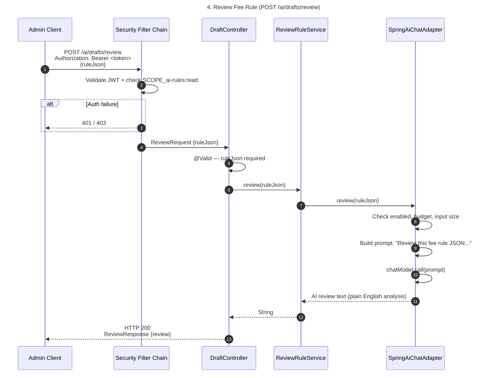

### Step Details

- **Step 1 — POST /ai/drafts/review:** Admin submits a fee rule JSON for AI analysis. Only requires `SCOPE_ai-rules:read` since this is a read-only analysis that does not modify any state. The response is ephemeral — no draft is created or persisted.
- **Step 2 — Auth:** JWT validation + `SCOPE_ai-rules:read` check. This is the only write-path endpoint that requires read scope instead of write scope.
- **Step 3 — @Valid:** `ReviewRequest` has `@NotBlank` on `ruleJson`, ensuring the request body contains the rule to review.
- **Step 4 — Delegate to AI:** `ReviewRuleService` is a thin service that delegates directly to `AiChatPort.review()`. No domain logic or validation is applied to the input — the AI analyses whatever JSON is provided.
- **Step 5 — AI prompt:** The user message asks the model to review: (1) what payments the rule matches, (2) schema constraint violations, (3) potential conflicts. The system prompt provides the full fee rule schema as context.
- **Step 6 — Raw text response:** Unlike generate, the review response is returned as raw text — the AI's natural language analysis. No JSON parsing is performed. The `ReviewResponse` wraps the text in a simple `{review: "..."}` JSON object.

---

## 5. Dry-Run Draft

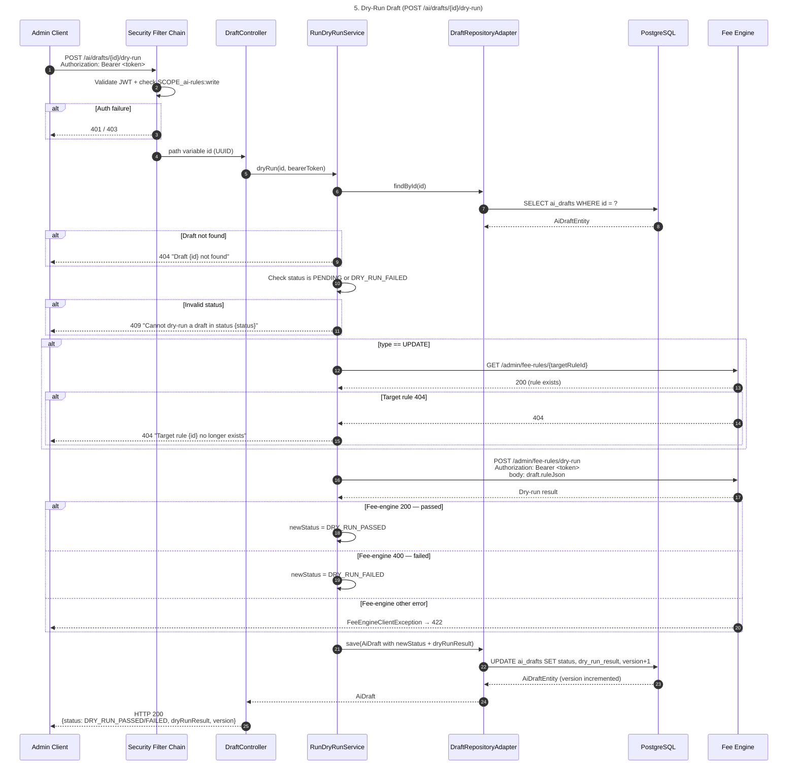

### Step Details

- **Step 1 — POST /ai/drafts/{id}/dry-run:** Admin triggers a dry-run of the draft's rule JSON against the fee-engine. The admin's bearer token is forwarded to fee-engine for authorisation. Requires `SCOPE_ai-rules:write`.
- **Step 2 — Auth:** JWT validation + `SCOPE_ai-rules:write` check.
- **Step 3 — Load draft:** Service loads the draft by id. If not found, throws `DraftNotFoundException` → 404.
- **Step 4 — Status check:** Dry-run is only allowed from `PENDING` or `DRY_RUN_FAILED` status. Drafts in `DRY_RUN_PASSED`, `APPROVED`, or `REJECTED` cannot be dry-run. `DRY_RUN_FAILED` is allowed to support re-edit → re-dry-run cycles without an intermediate status change.
- **Step 5 — Target rule verification (UPDATE only):** For UPDATE drafts, the service verifies the target rule still exists in fee-engine before running the dry-run. If the target was deleted, throws `TargetRuleNotFoundException` → 404. This prevents dry-running against a non-existent rule.
- **Step 6 — Fee-engine dry-run:** The draft's `ruleJson` is posted to fee-engine's `POST /admin/fee-rules/dry-run` endpoint. The admin's bearer token is forwarded in the `Authorization` header. Fee-engine evaluates the transient rule without persisting it.
- **Step 7 — Result mapping:** A 200 response from fee-engine maps to `DRY_RUN_PASSED`; a 400 response maps to `DRY_RUN_FAILED`. Both carry the fee-engine's response body in `dryRunResult`. Other status codes throw `FeeEngineClientException` → 422.
- **Step 8 — Persist result:** The draft's status and `dryRunResult` are updated. Re-running from `DRY_RUN_FAILED` directly overwrites the status and result — no intermediate `PENDING` write. The `@Version` column is incremented for optimistic locking.

---

## 6. Approve Draft

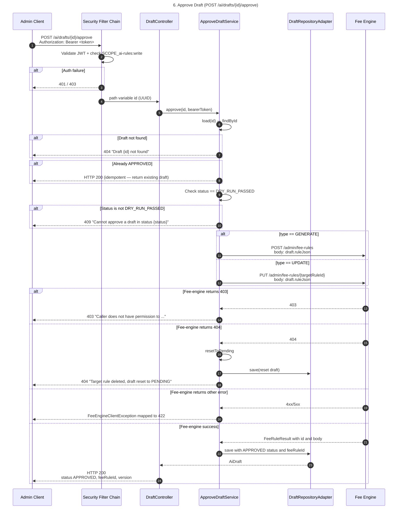

### Step Details

- **Step 1 — POST /ai/drafts/{id}/approve:** Admin approves a draft that has passed dry-run. The admin's bearer token is forwarded to fee-engine for the actual rule creation/update. Requires `SCOPE_ai-rules:write`.
- **Step 2 — Auth:** JWT validation + `SCOPE_ai-rules:write` check.
- **Step 3 — Load draft:** Service loads the draft. If not found → 404.
- **Step 4 — Idempotency:** If the draft is already `APPROVED`, the service returns it as-is without calling fee-engine. This makes the approve endpoint safe to retry.
- **Step 5 — Status guard:** Only drafts in `DRY_RUN_PASSED` status can be approved. This enforces the human-in-the-loop workflow — the rule must have been validated via dry-run first.
- **Step 6 — Fee-engine mutation:** For `GENERATE` drafts, the rule is created via `POST /admin/fee-rules`. For `UPDATE` drafts, the existing rule is replaced via `PUT /admin/fee-rules/{targetRuleId}`. The admin's bearer token authorises the fee-engine operation.
- **Step 7 — Permission denied (403):** If the admin's token lacks the appropriate fee-engine scope, fee-engine returns 403. The service wraps this in `FeeEnginePermissionDeniedException` → 403 with a descriptive message.
- **Step 8 — Target deleted (404):** Only for UPDATE drafts. If the target rule was deleted between dry-run and approve, the draft is reset to `PENDING` (clearing `dryRunResult`) and `TargetRuleNotFoundException` is thrown → 404. The admin can then re-run dry-run or reject.
- **Step 9 — Success:** The draft status is set to `APPROVED` and the `feeRuleId` returned by fee-engine is stored on the draft, linking it to the persisted rule. The version is incremented.

---

## 7. Reject Draft

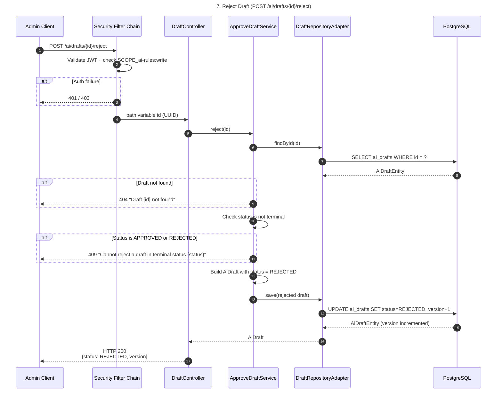

### Step Details

- **Step 1 — POST /ai/drafts/{id}/reject:** Admin rejects a draft. Does not require forwarding the bearer token to fee-engine — rejection is purely local. Requires `SCOPE_ai-rules:write`.
- **Step 2 — Auth:** JWT validation + `SCOPE_ai-rules:write` check.
- **Step 3 — Load draft:** Service loads the draft by id. If not found → 404.
- **Step 4 — Terminal check:** `REJECTED` and `APPROVED` are terminal states. A draft that is already in a terminal state cannot be rejected — the `DraftStatus.isTerminal()` check prevents this. Returns 409 with the current status.
- **Step 5 — Persist rejection:** The draft status is set to `REJECTED`. The `feeRuleId` and `dryRunResult` are preserved from the previous state (not cleared). The version is incremented via `@Version`.

---

## 8. Update Draft Rule JSON

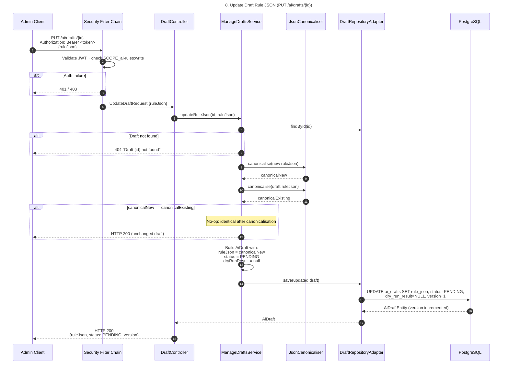

### Step Details

- **Step 1 — PUT /ai/drafts/{id}:** Admin manually edits the rule JSON of a draft — typically to fix issues found during dry-run or AI review. Requires `SCOPE_ai-rules:write`.
- **Step 2 — Auth:** JWT validation + `SCOPE_ai-rules:write` check.
- **Step 3 — Load draft:** Service loads the draft by id. If not found → 404.
- **Step 4 — Canonical comparison:** Both the new and existing rule JSON are canonicalised (sorted keys). If they are identical after canonicalisation, the update is a no-op — the draft is returned unchanged without a DB write.
- **Step 5 — Reset to PENDING:** Any manual edit resets the draft to `PENDING` status and clears the `dryRunResult`. This enforces the rule that a draft must be re-dry-run after any change before it can be approved.
- **Step 6 — Persist:** The updated draft is saved with the new canonical JSON, `PENDING` status, null `dryRunResult`, and incremented version.

---

## 9. Draft Lifecycle State Machine

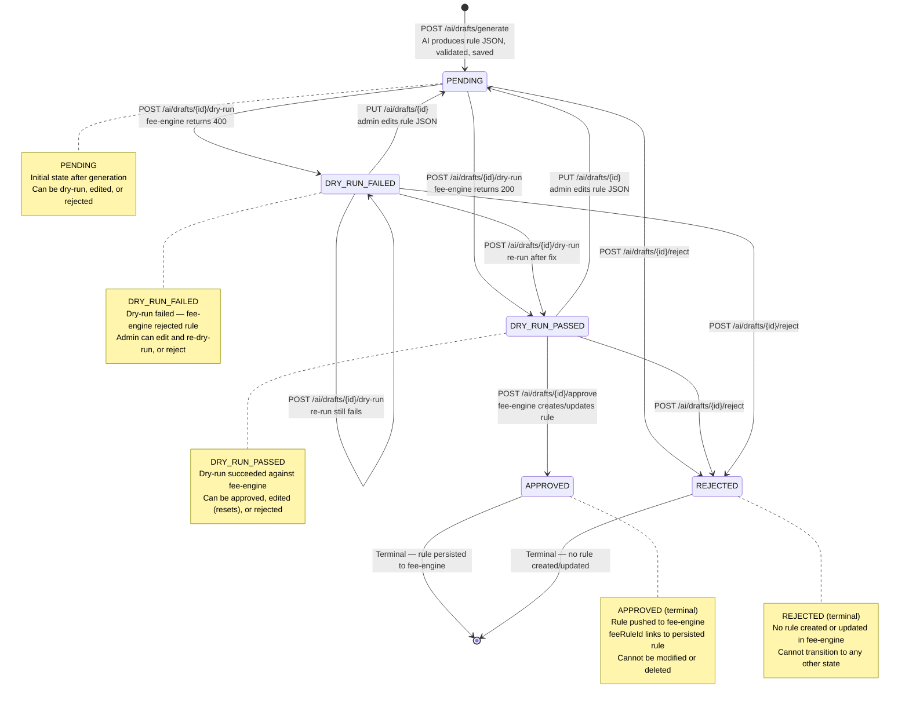

### State Details

- **PENDING → PENDING (via PUT):** Not a direct transition — editing the rule JSON via `PUT /ai/drafts/{id}` re-saves the draft with status `PENDING`. If the draft was already `PENDING`, the status is unchanged but the rule JSON and version are updated.
- **PENDING → DRY_RUN_PASSED:** The draft's rule JSON passes fee-engine's dry-run validation. The `dryRunResult` is populated with the fee-engine response.
- **PENDING → DRY_RUN_FAILED:** The draft's rule JSON fails fee-engine's dry-run validation (e.g. conflicts with existing rules). The `dryRunResult` contains the error details.
- **DRY_RUN_PASSED → APPROVED:** The admin approves the draft. The rule is created (`GENERATE`) or updated (`UPDATE`) in fee-engine. The returned `feeRuleId` is stored on the draft.
- **DRY_RUN_PASSED → PENDING (via PUT):** An admin edit after a successful dry-run resets the draft to `PENDING`, clearing the `dryRunResult`. The draft must be re-dry-run before approval.
- **DRY_RUN_FAILED → PENDING (via PUT):** Admin fixes the rule JSON. Status resets to `PENDING`, clearing the failed `dryRunResult`.
- **DRY_RUN_FAILED → DRY_RUN_PASSED/FAILED:** Admin can re-dry-run without editing (if they believe the failure was transient or want to re-test unchanged). The new result overwrites the previous status and `dryRunResult`.
- **APPROVED (terminal):** The rule is live in fee-engine. The draft cannot be modified, rejected, or re-dry-run. It cannot be deleted (`APPROVED drafts cannot be deleted`).
- **REJECTED (terminal):** The draft was rejected without creating/updating any rule. It cannot transition to any other state.

---

## 10. Full Draft Lifecycle — End-to-End

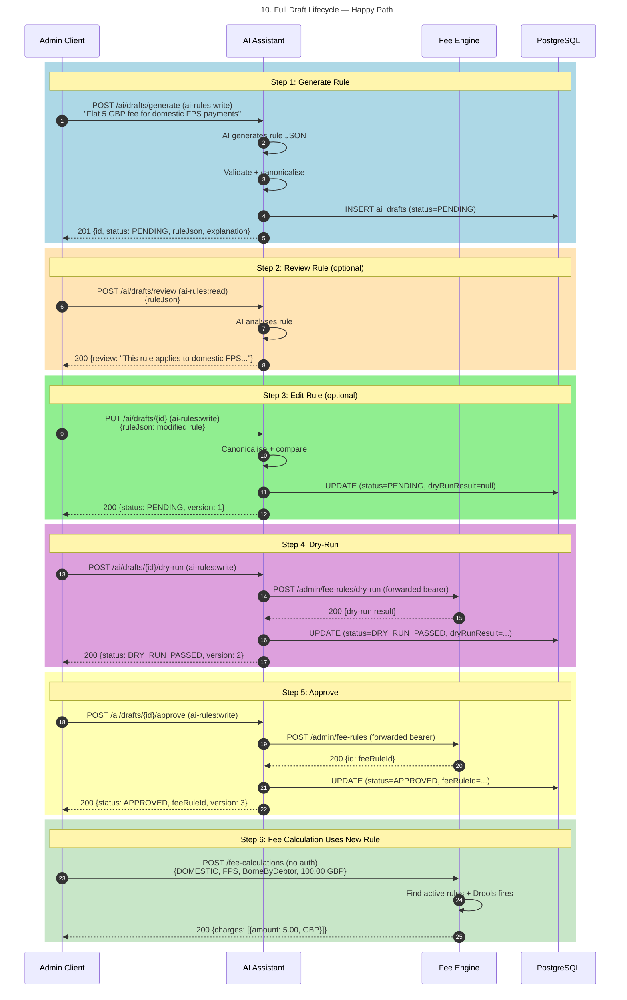

### Step Details

- **Step 1 — Generate Rule (blue):** Admin describes the desired fee rule in natural language. The AI assistant generates structured JSON, validates it against the fee rule schema (including cross-field fee-type constraints), canonicalises the output, and persists a draft in `PENDING` status.
- **Step 2 — Review Rule (orange, optional):** Admin can request an AI review of the generated rule at any time. This is a stateless operation — no draft is created or modified. The AI analyses what payments the rule matches, identifies schema violations, and flags potential conflicts.
- **Step 3 — Edit Rule (green, optional):** Admin can manually edit the rule JSON. This resets the draft to `PENDING` and clears the `dryRunResult`, ensuring the modified rule must be re-validated. If the edit is identical after canonicalisation, it's a no-op.
- **Step 4 — Dry-Run (purple):** Admin triggers a dry-run against fee-engine. The draft's rule JSON is sent to fee-engine's transient evaluation endpoint. A 200 response sets `DRY_RUN_PASSED`; a 400 response sets `DRY_RUN_FAILED`. The result details are stored in `dryRunResult`.
- **Step 5 — Approve (yellow):** After a successful dry-run, admin approves the draft. The rule is pushed to fee-engine via `POST /admin/fee-rules` (GENERATE) or `PUT /admin/fee-rules/{targetRuleId}` (UPDATE). The returned `feeRuleId` is stored on the draft. The draft enters the terminal `APPROVED` state.
- **Step 6 — Fee Calculation (light green):** The newly created rule is now live in fee-engine. Payment services calculate fees as normal — the rule is matched by the active-rule lookup and evaluated by Drools.

---

## 11. Retention Job

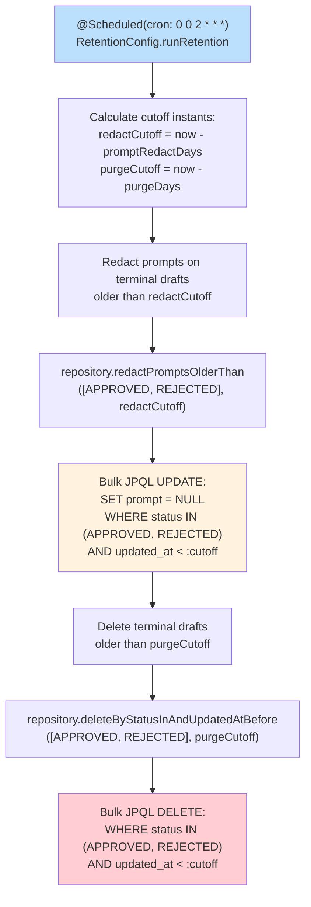

### Step Details

- **Schedule:** Runs daily at 02:00 via `@Scheduled(cron = "0 0 2 * * *")`. The `@Transactional` annotation ensures both operations run in a single transaction.
- **Redact prompts:** Bulk JPQL `UPDATE` sets `prompt = NULL` on `APPROVED` and `REJECTED` drafts whose `updated_at` is older than `prompt-redact-days` (default 30). This removes sensitive natural language prompts from old drafts while preserving the rule JSON and metadata for audit.
- **Bypasses repository port:** `RetentionConfig` calls `AiDraftJpaRepository` directly instead of going through the `DraftRepository` port. This is intentional — the repository port's `save()` method would trigger `@PreUpdate` callbacks that bump `updated_at`, effectively extending the purge window from T+90 to T+120.
- **Purge drafts:** Bulk JPQL `DELETE` removes `APPROVED` and `REJECTED` drafts whose `updated_at` is older than `purge-days` (default 90). After redaction, these drafts contain no sensitive prompt data — only the rule JSON, status, and audit timestamps.

---

## 12. Security Filter Chain

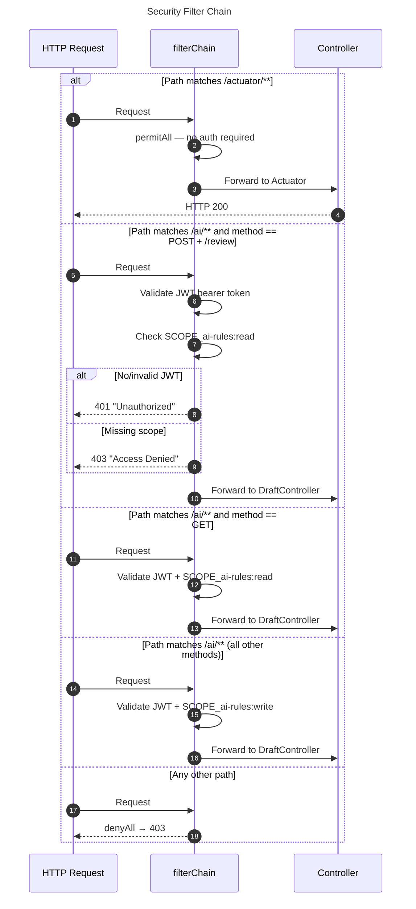

### Step Details

- **Single filter chain:** Unlike fee-engine which has two ordered chains, this service uses a single `SecurityFilterChain` with method and path-based authorisation rules. Stateless session management (`SessionCreationPolicy.STATELESS`) and CSRF disabled.
- **Actuator (permitAll):** `/actuator/**` paths are fully open — no authentication required. Exposes health, info, and prometheus endpoints for monitoring infrastructure.
- **POST /ai/drafts/review (read scope):** The review endpoint is the only write-method endpoint that requires `SCOPE_ai-rules:read` instead of `write`. This allows read-only admins to request AI analysis without draft modification privileges.
- **GET /ai/** (read scope):** All GET endpoints (list drafts, get single draft) require `SCOPE_ai-rules:read`.
- **All other /ai/** (write scope):** POST (generate, dry-run, approve, reject), PUT (update rule JSON), DELETE require `SCOPE_ai-rules:write`.
- **denyAll:** Any path not matching `/actuator/**` or `/ai/**` is denied with 403.
- **Error responses:** Both `authenticationEntryPoint` (401) and `accessDeniedHandler` (403) write RFC 7807 `ProblemDetail` responses with `Content-Type: application/problem+json`.

---

## 13. Error Responses

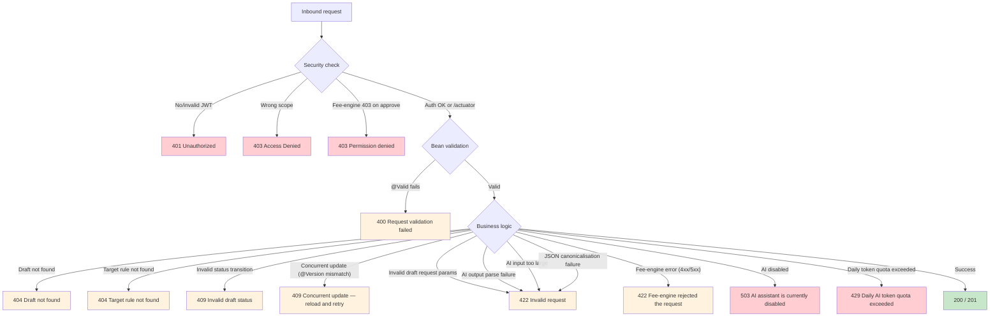

### Node Details

- **401 Unauthorized:** No `Authorization` header, malformed token, expired token, or unrecognised signature. `authenticationEntryPoint` writes `ProblemDetail` with `status: 401`.
- **403 Access Denied:** Valid JWT but missing the required scope for the HTTP method and path. `accessDeniedHandler` writes `ProblemDetail` with `status: 403`.
- **403 Permission denied:** Fee-engine returns 403 during approve — the admin's token lacks fee-engine write scope. Wrapped in `FeeEnginePermissionDeniedException` with a descriptive message.
- **400 Request validation failed:** Bean Validation (`@Valid`) rejects the request — missing required fields, size constraint violations on `prompt`.
- **404 Draft not found:** `DraftNotFoundException` from any service when `findById` returns empty.
- **404 Target rule not found:** `TargetRuleNotFoundException` when the fee-engine target rule for an UPDATE draft doesn't exist (404 from fee-engine). During approve, the draft is reset to PENDING before the exception is thrown.
- **409 Invalid draft status:** `InvalidDraftStatusException` when a status transition is not allowed — e.g. dry-running an `APPROVED` draft, approving a `PENDING` draft.
- **409 Concurrent update:** `ObjectOptimisticLockingFailureException` from JPA `@Version` when two requests modify the same draft concurrently. The caller must reload and retry.
- **422 Invalid request:** `InvalidDraftRequestException` for business rule violations — e.g. null `targetRuleId` on UPDATE, deleting an APPROVED draft.
- **422 AI output parse failure:** `AiOutputParseException` when AI returns non-JSON or JSON missing the expected `rule`/`explanation` fields. Includes a 500-char preview of the raw output.
- **422 AI input too large:** `AiInputTooLargeException` when the combined prompt exceeds `maxInputChars`.
- **422 JSON canonicalisation failure:** `CanonicalisationException` when the rule JSON cannot be parsed during canonicalisation (invalid JSON).
- **422 Fee-engine rejected:** `FeeEngineClientException` for fee-engine errors not mapped to a more specific status. The response includes a `feeEngineProblem` property with the fee-engine's error body.
- **503 AI disabled:** `AiDisabledException` when `ai-assistant.chat.enabled` is `false`.
- **429 Quota exceeded:** `AiQuotaExceededException` when the daily token budget is exhausted.

---

## Legend

| Symbol | Meaning |
|--------|---------|
| `AiDraft` | Domain record — immutable, carries draft state across layers |
| `DraftStatus` | Enum: `PENDING`, `DRY_RUN_PASSED`, `DRY_RUN_FAILED`, `APPROVED`, `REJECTED` |
| `DraftType` | Enum: `GENERATE` (new rule), `UPDATE` (modify existing rule) |
| `FeeRuleSchema` | Application-layer validation record — mirrors fee-engine rule structure |
| `GenerationResult` | AI output record: `{ruleJson, explanation}` |
| `DryRunResult` | Fee-engine dry-run output: `{passed, body}` |
| `FeeRuleResult` | Fee-engine mutation output: `{id, body}` |
| `JsonCanonicaliser` | Alphabetical key-sort for deterministic JSON storage |
| `AiChatBudget` | In-memory daily token usage tracker |

### Security Scopes

| Scope | Permitted operations |
|-------|---------------------|
| `SCOPE_ai-rules:read` | `POST /ai/drafts/review`, `GET /ai/**` |
| `SCOPE_ai-rules:write` | `POST /ai/drafts/generate`, `PUT /ai/drafts/{id}`, `DELETE /ai/drafts/{id}`, `POST /ai/drafts/{id}/dry-run`, `POST /ai/drafts/{id}/approve`, `POST /ai/drafts/{id}/reject` |
| *(none required)* | `/actuator/**` |

### AI Metrics

| Metric | Type | Tags |
|--------|------|------|
| `ai.assistant.chat.duration` | Timer | `operation` (generate/review), `outcome` (success/parse_error/server_error) |
| `ai.assistant.chat.tokens.input` | DistributionSummary | `operation` |
| `ai.assistant.chat.tokens.output` | DistributionSummary | `operation` |
| `ai.assistant.chat.tokens.input.estimated` | DistributionSummary | `operation` |
| `ai.assistant.chat.tokens.output.estimated` | DistributionSummary | `operation` |
| `ai.assistant.chat.errors` | Counter | `operation`, `error_type` (disabled, quota_exceeded, parse_error, etc.) |

### Key Constraints

| Constraint | Behaviour |
|-----------|-----------|
| `chk_prompt_length` | `char_length(prompt) <= 2000` on `ai_drafts` table |
| `chk_rule_json_size` | `length(rule_json::text) <= 50000` on `ai_drafts` table |
| Optimistic locking | `@Version` on `AiDraftEntity` — concurrent updates return 409 |
| Terminal state immutability | `APPROVED`/`REJECTED` drafts cannot transition to any other state |
| Dry-run gate | Only `DRY_RUN_PASSED` drafts can be approved |
| Edit resets status | `PUT /ai/drafts/{id}` resets to `PENDING` and clears `dryRunResult` |
| APPROVED delete guard | `APPROVED` drafts cannot be deleted |
